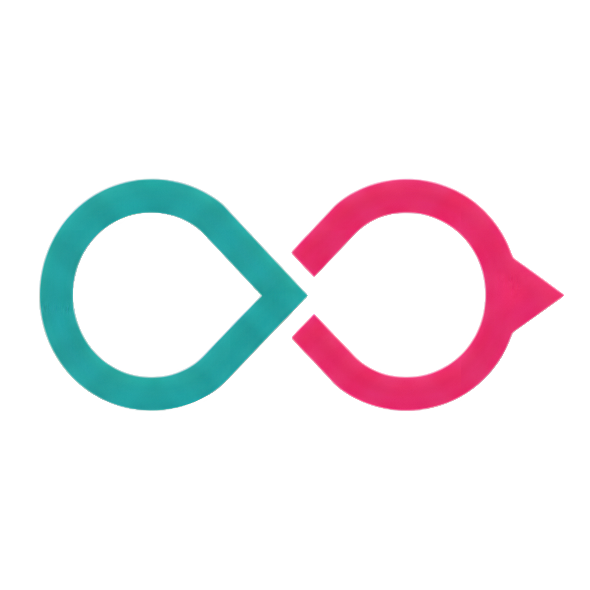

<p align="center">
  
</p>

<h1 align="center">AutoResolve</h1>

<p align="center">
  A customer-side AI email agent that tracks support cases, sends guarded<br/>
  follow-ups, and hands off to a human when a reply needs judgment.
</p>

<p align="center">
  <a href="https://github.com/arjun-kuttikkat/AutoResolve/releases/tag/v1.0.0"></a>
  <a href="LICENSE"></a>
  
  
</p>

---

## Recognition

**3rd Place — 1,000 AED Prize** at the **AI Agents Innovation Hackathon**, hosted at
**Heriot-Watt University Dubai** and organized by the **Heriot-Watt Tech Club** and **Rabbitron Lab**.

AutoResolve was built and demoed live as v1.0.0 during the hackathon.

## What it does

AutoResolve sits on the customer side of a support conversation. You connect your Gmail
inbox, and the agent takes it from there:

- **Tracks every support case as a thread** — incoming vendor/support emails are synced
  in real time and grouped into cases on a live dashboard.
- **Follows up for you, with guardrails** — when a case stalls, the agent drafts a polite
  follow-up using the full thread history. In `auto` mode it sends after a short
  countdown; in `approval` mode nothing leaves your inbox until you approve it.
- **Hands off when judgment is needed** — a classification step decides whether an email
  can be answered safely, needs a human, or should be escalated. Anything ambiguous
  surfaces as a notification instead of a risky auto-send.
- **Respects your rules** — per-user guardrails (tone, escalation addresses, forbidden
  content, auto-reply criteria) are checked before any reply is generated or sent.

## Features

- Gmail OAuth 2.0 connection with encrypted token storage and automatic refresh
- Real-time mailbox sync via Gmail push notifications (Google Pub/Sub) with history-based delta sync and automatic full resync fallback
- AI reply drafting (OpenAI) over full thread context, with confidence scoring
- Safety gates: classification (`reply` / `needs_human` / `escalate`), guardrail enforcement, and approval/auto send modes
- Human-intervention notification panel with per-thread context
- Draft approve / edit / reject flow; rejected drafts never send
- Background job queue (BullMQ + Redis) for sync, reply generation, and token refresh workers

## Architecture

```
┌────────────┐   Gmail API / Pub/Sub   ┌─────────────────────────────┐
│   Gmail    │ ───────────────────────▶│  Backend (Express + tsx)    │
└────────────┘                         │  src/routes   — REST API    │
                                       │  src/services — sync, AI,   │
┌────────────┐    REST (fetch)         │    safety gates, tokens     │
│  Web (Next │◀───────────────────────▶│  src/workers  — BullMQ jobs │
│  16 + TW)  │                         └───────┬─────────────┬───────┘
└────────────┘                                 │             │
                                        ┌──────▼──────┐ ┌────▼─────┐
                                        │ PostgreSQL  │ │  Redis   │
                                        │ (Supabase)  │ │ (BullMQ) │
                                        └─────────────┘ └──────────┘
```

- **`web/`** — Next.js 16 dashboard (React 19, Tailwind CSS 4, Framer Motion, Geist). Inbox of tracked threads, draft review, guardrail settings, notification panel.
- **`backend/`** — Node.js + Express + TypeScript API and workers. Gmail sync, OpenAI reply generation, safety-gate pipeline, OAuth token management.

## Quick start

Prerequisites: Node.js 22+, a PostgreSQL database ([Supabase](https://supabase.com) works well), Redis, Google Cloud OAuth credentials, and an OpenAI API key.

```bash
# 1. Install dependencies
npm install --prefix web
npm install --prefix backend

# 2. Configure the backend
cp backend/.env.example backend/.env
#    fill in DATABASE_URL, REDIS_URL, GOOGLE_CLIENT_ID/SECRET,
#    OPENAI_API_KEY, ENCRYPTION_KEY (openssl rand -base64 32)

# 3. Apply the database migrations
#    run backend/src/db/migrations/0000_*.sql → 0003_*.sql in order
#    (Supabase: SQL Editor → paste → Run — see backend/README.md)

# 4. Start Redis, then run the app
docker run -p 6379:6379 redis          # or any Redis
npm run dev:backend                    # API on :3001
npm run worker --prefix backend        # email worker (separate terminal)
npm run dev                            # dashboard on :3000
```

Then open <http://localhost:3000/dashboard> and connect your Gmail account.
Full environment reference, Supabase walkthrough, troubleshooting, and the API
reference live in [backend/README.md](backend/README.md).

## Repository structure

```
.
├── web/                      # Next.js dashboard
│   ├── app/                  #   routes (/, /dashboard, /dashboard/customers)
│   ├── components/           #   shared components (logo, …)
│   └── lib/api.ts            #   typed API client
└── backend/                  # Express API + workers
    ├── src/routes/           #   auth, emails, users, pubsub
    ├── src/services/         #   gmail, openai, sync, safety gates, tokens
    ├── src/workers/          #   BullMQ workers (email, token refresh)
    └── src/db/               #   Drizzle schema + SQL migrations
```

## How the safety gates work

Every inbound message flows through a pipeline before anything is generated or sent:

1. **Classify** — can this be answered safely, does it need a human, or should it escalate?
2. **Guardrails** — the user's own rules (tone, escalation contacts, never-say list) are applied.
3. **Draft** — a reply grounded in the full thread history, with a confidence score.
4. **Gate** — `auto` mode sends after a visible countdown; `approval` mode waits for a human click.
5. **Notify** — anything uncertain lands in the notification panel for human judgment.

## License

[MIT](LICENSE) © 2026 Arjun Kuttikkat
